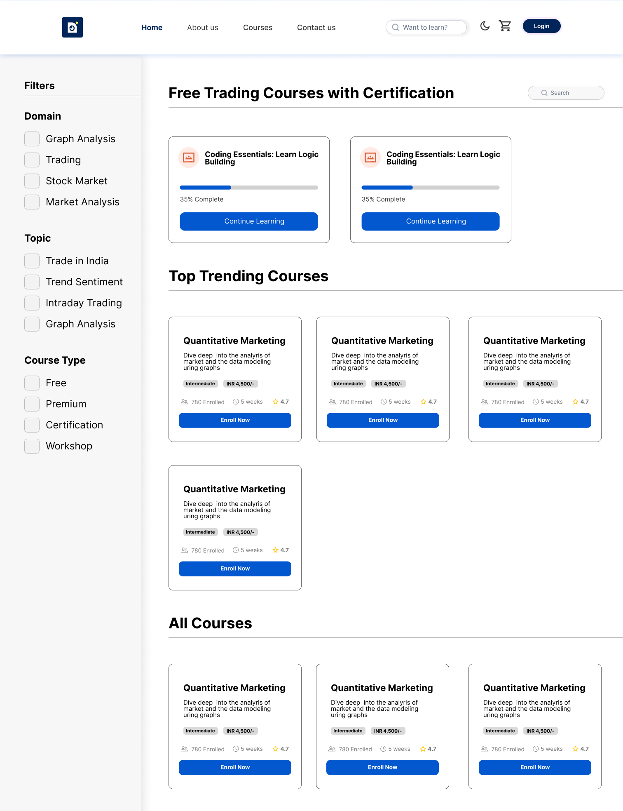
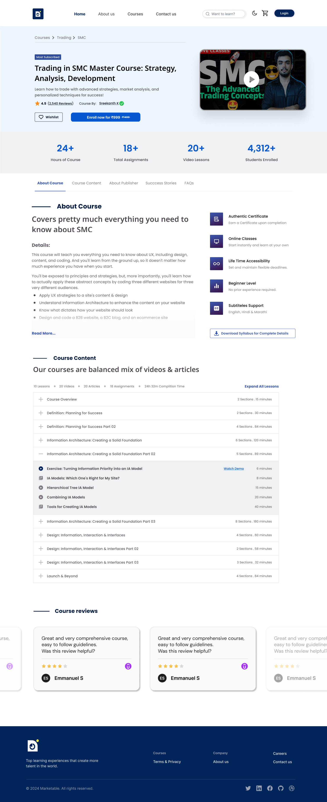
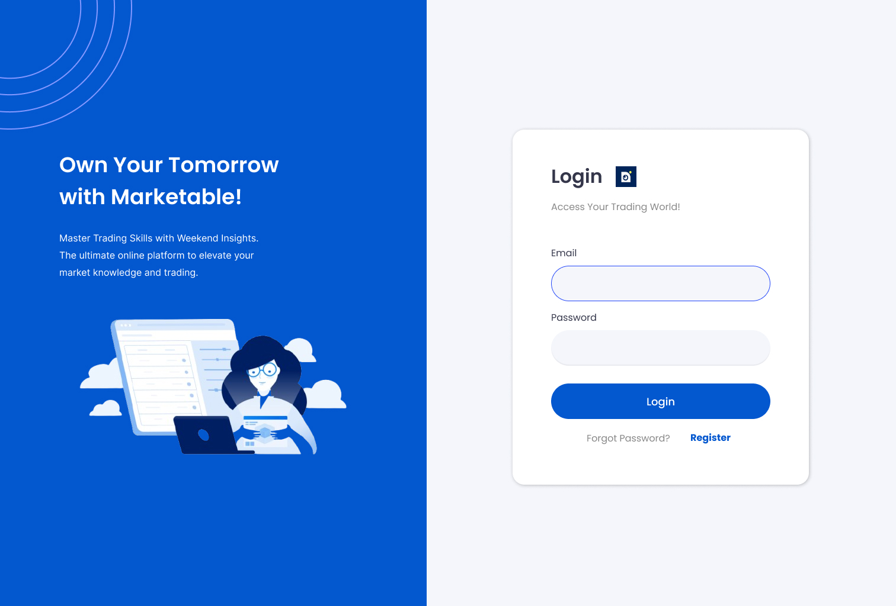
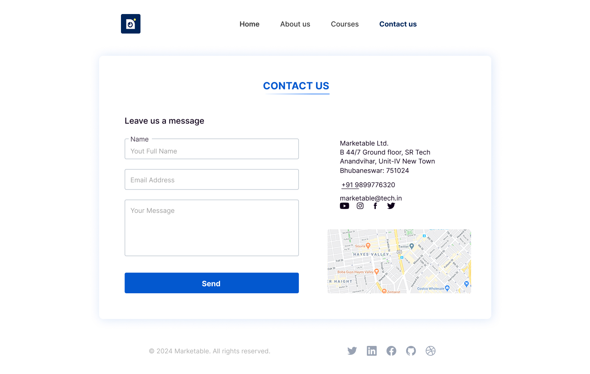
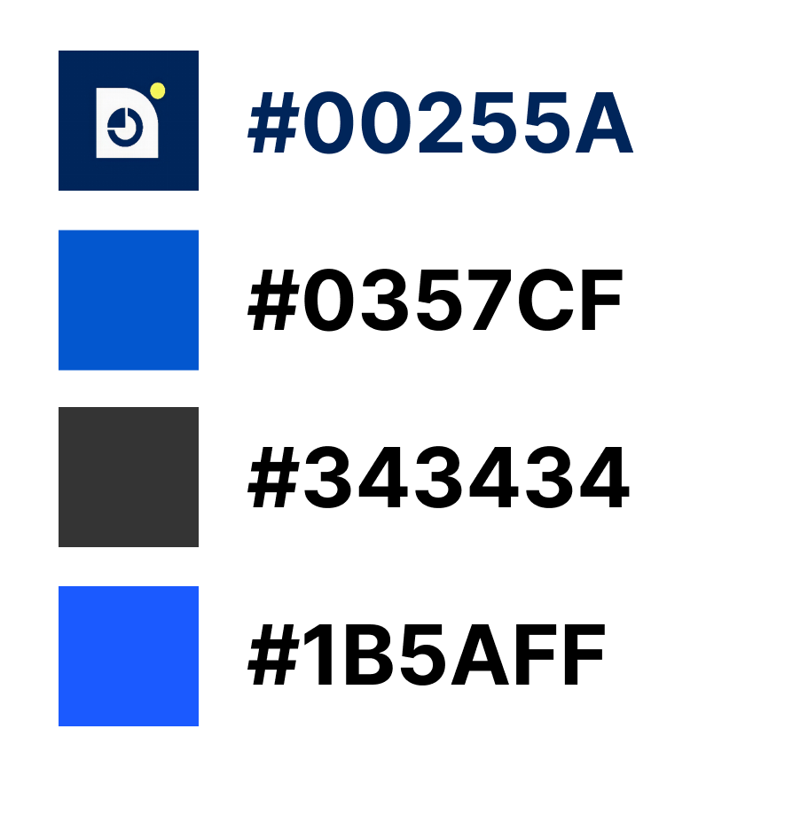

# Project Design

## 🎨 Figma Design

The **Inter** font is used throughout the project design for a clean, modern, and easy-to-read user interface.

---

### 1. **Landing Page**

The **Landing Page** serves as the first impression of the platform. It is designed to capture users' attention and provide clear navigation to other parts of the website. The design emphasizes a welcoming and professional look with a well-organized layout.

**Screenshot:**

---

### 2. **Course Page**

The **Course Page** is where users can explore all available courses. The design focuses on a user-friendly layout, ensuring easy navigation through different courses and detailed information about each one.

**Screenshot:**

---

### 3. **Course Details Page**

The **Course Details Page** provides a deeper dive into each course. It includes course content, key details, and essential information for users to make informed decisions. The layout is designed for clarity and simplicity.

**Screenshot:**

---

### 4. **Login Page**

The **Login Page** is designed to provide users with an easy and secure way to access their accounts. The page ensures smooth navigation for returning users, while also allowing for new user sign-ups.

**Screenshot:**

---

### 5. **Contact Page**

The **Contact Page** is designed to facilitate communication between users and the platform’s support team. It includes easy-to-fill forms and other essential contact details.

**Screenshot:**

---

### 6. **Color Guide**

The **Color Guide** is an essential visual tool that ensures consistency across the platform. It defines the primary and secondary color palette used throughout the design, which contributes to the platform’s overall branding and accessibility.

**Screenshot:**

---

## 🔗 View the Full Figma Design

To explore the complete design, including all pages and interactions, click the link below to view the full Figma design:

[**View Figma Design**](https://www.figma.com/design/oOKxcAuk43U2Wl7nq0T9zs/(Priti)-Marketable?node-id=122-367&t=sfmLx6EMPxTMDpoQ-1)

Feel free to explore the layout, interactions, and details for a better understanding of the design vision!

Landing page code is available at this link:
[**View the Code**](https://github.com/priti200/marketable)

## 👩‍💻 Designed by Priti
